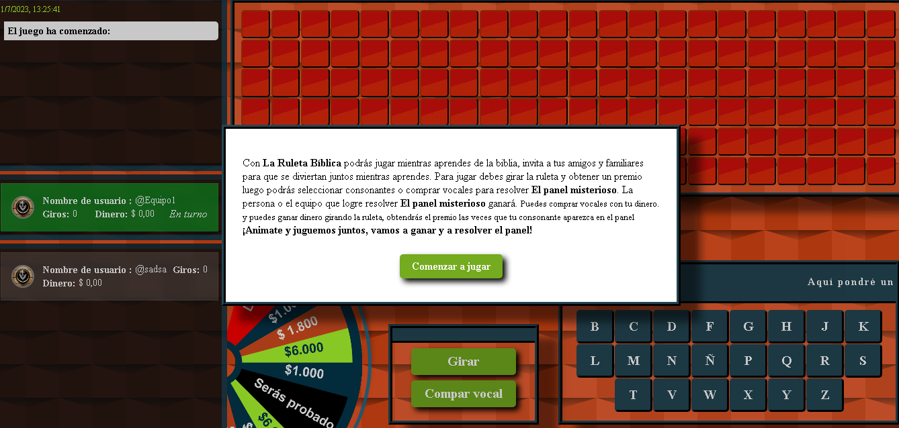
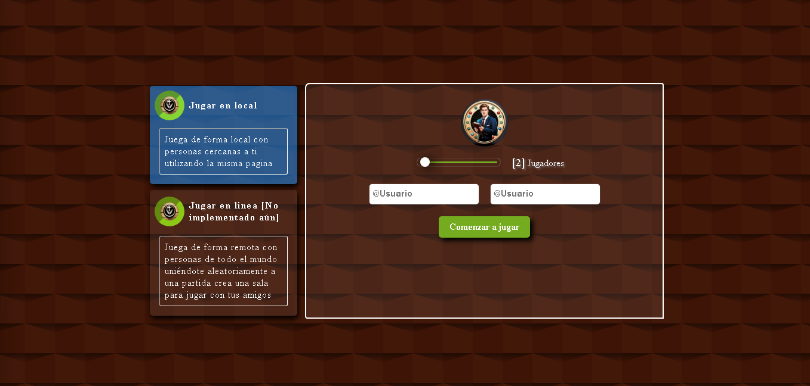
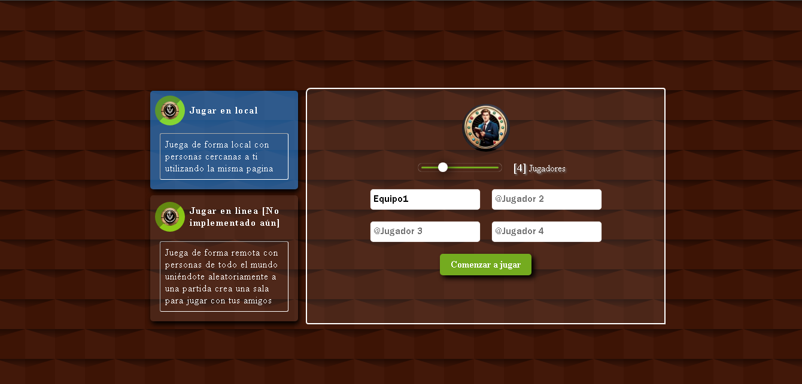

# Juego de la Ruleta Bíblica

Este es un juego de la Ruleta Bíblica donde los jugadores giran la ruleta, obtienen dinero y seleccionan consonantes para revelar letras en un tablero. Si la letra está en la palabra misteriosa, ganan dinero multiplicado por las veces que aparezca. También pueden comprar vocales con su dinero.

## Vistas del juego

A continuación se presentan algunas vistas del juego:

- Vista de la ruleta: 
- Vista de la ruleta: 
- Vista de la ruleta: 

## Contribuciones

Las contribuciones están cerradas actualmente ya que gran parte de el código del juego actualmente se encuentra en repositorio local por lo que tal vez no puedas correrlo correctamente al clorar el repositorio y no está en ejecución. Sin embargo, se adjuntan las vistas del juego para que puedas revisarlas y aportar al proyecto.
Si deseas contribuir al juego de la Ruleta Bíblica en futuro por favor espera a que se esté disponible el primer demo y luego de eso, por favor sigue los siguientes pasos:

1. Haz un fork de este repositorio.
2. Realiza los cambios o mejoras que desees en tu fork.
3. Crea un pull request para revisar tus cambios y considerar su incorporación al proyecto principal.

## Próximas actualizaciones

Próximamente estará disponible una versión demo del juego que solo permitirá jugar en modo local. Asimismo, se planea lanzar la versión 1 con la posibilidad de jugar de forma remota.

¡Esperamos tus aportes y disfruta del juego de la Ruleta Bíblica!
